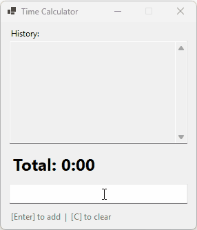

# Time Calculator

A simple Windows Forms app for adding and subtracting time values with a running total.



## Usage

Type time values in HHMM format (no colon needed):
- `35` → 0:35 (35 minutes)
- `120` → 1:20 (1 hour 20 minutes)
- `-45` → subtract 45 minutes

**Keyboard shortcuts:**
- **Enter** - Add to total
- **C** or **Escape** - Clear all
- **Backspace** (empty input) - Undo last entry

## Download

Download the latest release from the [Releases](../../releases) page.

## Building from Source

Requires [.NET 6 SDK](https://dotnet.microsoft.com/download) or later.

```
dotnet build
dotnet run
```

To create a self-contained executable:
```
dotnet publish -c Release -r win-x64 --self-contained -p:PublishSingleFile=true
```

Output: `bin\Release\net6.0-windows\win-x64\publish\TimeCalculator.exe`
